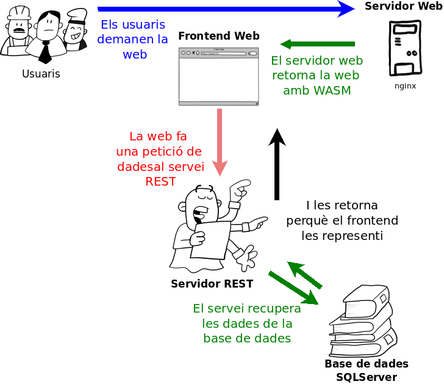

# Dia 3

Presentació ([aquí](https://docs.google.com/presentation/d/1Ap0gw2PujJWGaw5-PC2BDP4NsNsNyI2LHwGfjv5SuoQ/edit?usp=sharing))

## Tasca 1: Executar MySQL amb docker-compose

- Executeu una instància de MySQL o MariaDb fent servir Docker-compose

## Tasca 2: Iniciar dos contenidors

- Feu un docker-compose que permeti executar un Ubuntu i una base de dades
- En el contenidor Ubuntu instal·leu-hi el paquet `iputils-ping`
- Comproveu que podeu fer ping al contenidor de base de dades amb el seu nom

## Tasca 3: Iniciar dos contenidors amb dependències

- Desenvolupeu un fitxer `docker-compose` que executi la imatge `utrescu/data-creator` i una base de dades MySQL. El data-creator té per objectiu crear una taula `persones` i omplir-la amb dades
- Comproveu que la base de dades conté dades en la taula `persones`

> El data creator pot personalitzar-se rebent com a variables d'entorn `DATABASE_USER`, `DATABASE_PASSWORD`, `DATABASE_NAME` i `DATABASE_HOST`

## Tasca 4: Construir imatge i executar-la

- Feu un docker-compose que permeti iniciar l'aplicació weatherforecast creant-ne la imatge a partir del seu Dockerfile i mapejeu el port 80 al port local 8080
- Comproveu que funciona anant amb un navegador a http://localhost:8080/WeatherForecast

## Tasca 5: Construir un programa amb més components

Teniu un programa que fa servir una base de dades SQLServer, un servei REST i un frontend Blazor WASM (espantApp)

> NOTES:
>
> - El servei REST pot rebre les dades de connexió a la base de dades amb una variable d'entorn `ConnectionSettings__ConnectionString`
> - Els projectes Blazor WASM generen la web en un directori `wwwroot`. Aquesta web s'ha d'hostatjar en un servidor web.

- Construiu el fitxer docker-compose.yml que permeti iniciar el sistema de cop.
